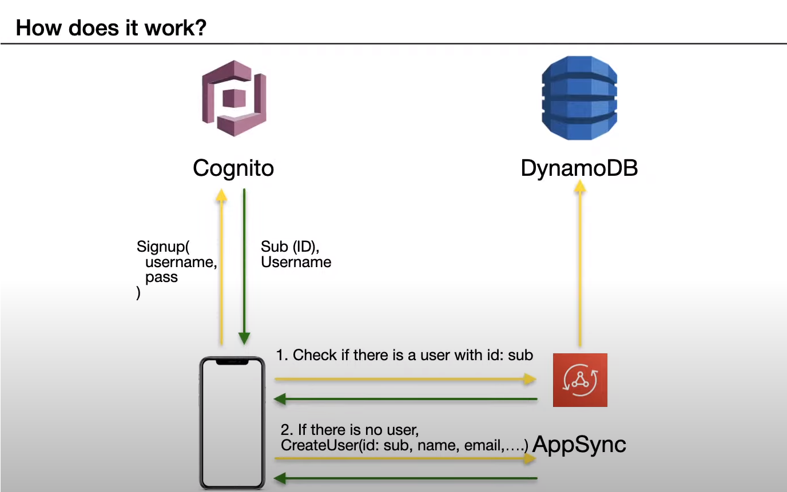
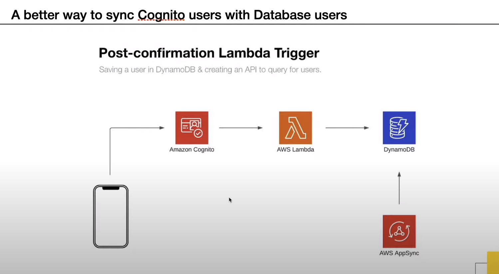

# uber_clone

## reference

- [Vadim Savin - Build the Uber clone in React Native (Tutorial for Beginners)](https://www.youtube.com/watch?v=sIRcN0MeZVU)
- [Vadim Savin - Build the Uber clone in React Native (Tutorial for Beginners) [2]](https://www.youtube.com/watch?v=_U4zgWcw2Ws)
- [Adding Users to DynamoDB using a Cognito Post-confirmation Lambda Trigger & Exposing a GraphQL API](https://www.youtube.com/watch?v=Sk9HMuAaTmQ)

## dependencies

- [React-Native-CLI](https://reactnative.dev/docs/environment-setup)
- [react-native-vector-icons](https://github.com/oblador/react-native-vector-icons)
- [react-native-google-places-autocomplete](https://github.com/FaridSafi/react-native-google-places-autocomplete)
- [react-native-maps](https://github.com/react-native-maps/react-native-maps)
- [react-native-maps-directions](https://github.com/bramus/react-native-maps-directions)

## init

- Chocolatey : openjdk8
- 환경변수 : JAVA_HOME, ANDROID_HOME, path 등록.

```sh
> npx react-native init Uber

> cd Uber
> yarn start

// New Terminal
> yarn android
```

### [react-native-vector-icons](https://github.com/oblador/react-native-vector-icons)

```
> yarn add react-native-vector-icons
```

```js
// android : add to the android/app/build.gradle
apply from: "../../node_modules/react-native-vector-icons/fonts.gradle"
```

### [react-native-google-places-autocomplete](https://github.com/FaridSafi/react-native-google-places-autocomplete)

```sh
> yarn add react-native-google-places-autocomplete
```

- google APIs : Places API

### [react-native-maps](https://github.com/react-native-maps/react-native-maps)

- [installation](https://github.com/react-native-maps/react-native-maps/blob/master/docs/installation.md)

```sh
> yarn add react-native-maps -E
```

- "react-native": "0.63.4", Build configuration on Android

```sh
//! android/build.gradle
...
buildscript {
    ext {
        ...
        playServicesVersion = "17.0.0" // or find latest version
        androidMapsUtilsVersion = "2.2.0"
    }
}
...


//! android/app/src/main/AndroidManifest.xml
<application>
    //# You will only need to add this meta-data tag, but make sure it's a child of application
   <meta-data
     android:name="com.google.android.geo.API_KEY"
     android:value="Your Google maps API Key Here"/>

    //# You will also only need to add this uses-library tag
   <uses-library android:name="org.apache.http.legacy" android:required="false"/>
</application>
```

### [react-native-maps-directions](https://github.com/bramus/react-native-maps-directions)

```sh
> yarn add react-native-maps-directions
```

- GoogleAPIs : Directions API

### Maps: Marker direction

- Rotate the cars in the direction of their movement
  - make sure all images (assets) are facing up

### Places Autocomplete styles

### Places Autocomplete Current Location

- [react-native-geolocation/react-native-geolocation](https://github.com/react-native-geolocation/react-native-geolocation)

  - install geolocation

  ```
  > yarn add @react-native-community/geolocation
  ```

  - request permission to use location
  - use the location in places autocomplete component
  - add predefined location (HOME, WORK)?

### [React Navigation](https://reactnavigation.org/docs/getting-started)

- Install React-Navigation library and follow the installation guide

```
> yarn add @react-navigation/native

> yarn add react-native-reanimated react-native-gesture-handler react-native-screens react-native-safe-area-context @react-native-community/masked-view
```

- Defined all the screens in a Stack Navigator
- Implement the Navigation between screens
- Send data between screens

### Drawer Navigation(Hamburger Menu)

- install Drawer Navigation package
- Setup Basic Drawer Navigation
- Customize the Drawer Navigation

### [Setup AWS Amplify Project](https://docs.amplify.aws/start/q/integration/react-native?sc_icampaign=react-native-start&sc_ichannel=choose-integration)

- [전제조건을 만족하고 진행](https://www.youtube.com/watch?v=fWbM5DLh25U&feature=emb_title)

```
> amplify configure
// region : ap-northeast-2(서울)
// user name : amplify-user
// accessKeyId
// secretAccessKey
// Profile Name

> amplify init

> Choose your default editor : None
> Choose the type of app that you`re building : javascript
> What javascript framework are tou using : react-native
> Source Directory Paths : /

> yarn add aws-amplify aws-amplify-react-native amazon-cognito-identity-js @react-native-community/netinfo
```

- Configure the App.js

```js
import Amplify from 'aws-amplify';
import config from './aws-exports';
Amplify.configure(config);
```

### Authentication

- [Adding Users to DynamoDB using a Cognito Post-confirmation Lambda Trigger & Exposing a GraphQL API](https://www.youtube.com/watch?v=Sk9HMuAaTmQ)
  </img>
  </img>

- Setup Authentication

```
> amplify add auth
```

- Manual configuration
- Setup Lambda Triggers: Post confirmation
- create own module
- configure App.js

### GraphQL API

- init

```
> amplify add api
```

- 1.  Write User Model

```js
// amplify / backend / api / uber / schema.graphql
type User @model {
  id: ID!
  username: String!
  email: String!
}
```

- 2.  Push everything to the cloud (amplify push)

```
> amplify push

> amplify console
> Which site do you want to open? · Console
```

### Finish set-up of Lambda Function

- set the user table name as env variable
- give access to lambda to access the dynamoDB
- test it out

### try

- where from? : current location
- where to? : 1750 lundy avenue, san jose, ca

## Error

- 1. jdk 설치 문제

  - oracle || openjdk
  - 기존 설치된 oracle은 jre만 있음
  - Chocolatey : openjdk8 설치로 해결

- 2.  [module naming collision](https://github.com/aws-amplify/amplify-cli/issues/3295)

```sh
jest-haste-map: Haste module naming collision: uber9440930194409301PostConfirmation
  The following files share their name; please adjust your hasteImpl:
    * <rootDir>\amplify\#current-cloud-backend\function\uber9440930194409301PostConfirmation\src\package.json
    * <rootDir>\amplify\backend\function\uber9440930194409301PostConfirmation\src\package.json

Failed to construct transformer:  DuplicateError: Duplicated files or mocks. Please check the console for more info
    at setModule (C:\DEV\uber_clone\Uber\node_modules\metro\node_modules\jest-haste-map\build\index.js:620:17)
    at workerReply (C:\DEV\uber_clone\Uber\node_modules\metro\node_modules\jest-haste-map\build\index.js:691:9)
    at processTicksAndRejections (internal/process/task_queues.js:97:5)
    at async Promise.all (index 39) {
  mockPath1: 'amplify\\#current-cloud-backend\\function\\uber9440930194409301PostConfirmation\\src\\package.json',
  mockPath2: 'amplify\\backend\\function\\uber9440930194409301PostConfirmation\\src\\package.json'
}
```

```js
// metro.config.js
module.exports = {
	resolver: {
		blacklistRE: /#current-cloud-backend\/.*/,
	},
	transformer: {
		getTransformOptions: async () => ({
			transform: {
				experimentalImportSupport: false,
				inlineRequires: false,
			},
		}),
	},
};
```
